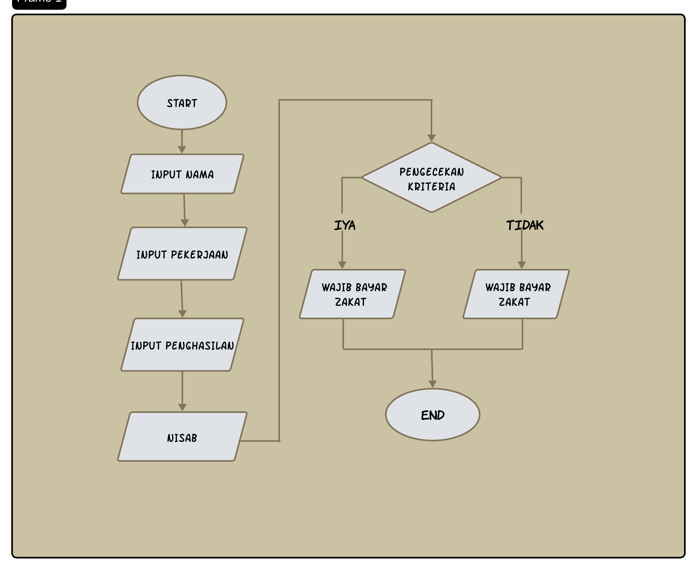

## PROGRAM PENGHITUNGAN ZAKAT  

# STUDI KASUS : OPTIMALISASI PEMBAGIAN ZAKAT UNTUK MENANGGULAGI MASALAH EKONOMI

Latar Belakang
Banyak keluarga Muslim mengalami kesulitan ekonomi yang mengakibatkan mereka tidak mampu memenuhi kebutuhan dasar seperti makanan, pendidikan, dan kesehatan. Zakat penghasilan yang dikelola dengan baik memiliki potensi besar untuk membantu mengatasi masalah ini. Studi kasus ini bertujuan untuk menghitung zakat penghasilan seorang individu berdasarkan aturan zakat dan memastikan bahwa distribusi zakat dilakukan secara tepat dan merata.

Program harus menerima input berupa :
 
Data Pribadi
1.Nama
2.Pekerjaan
3.Penghasilan

Kriteria
1.Fakir
2.Miskin
3.Amil
3.Niqob
4.Gharim dan Gharimin
5.Mualaf
6.Ibnu sabil
7.Fisabilillah
8.Nisab > dari Penghasilan Tahunan

Contoh Kasus
1.Nama :Ahmad
2.Pekerjaan : Pegawai Kantoran
3.penghasilan : Rp 10,000,000

Penghitungan
1.Input penghasilan bulanan : Rp 10,000,000
2.Hitung Penghasilan Tahunan : Rp 10,000, x 12 = Rp 120,000,000
3.Badingkan dengan Nisab : Nisab = Rp 85,000,000
  - Rp 120,000,000 >= Rp 85,000,000 ,jadi Ahamd wajib membayar zakat

Jika muslim/musliman itu memenuhi kriteria ,maka program akan mencetak nama,pekerjaan,penghasilan,dan penghasilan tahunan dan hasil bahwa muslim/muslimin itu wajib atau tidak wajib membayar zakat

## FLOWCART
